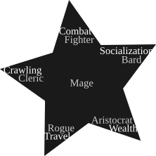

# Generic Epic Fantasy Constructor Playtest

## Wheel of aspects

There are five aspects to a fantasy game —

 * combat (tactical engagements)
 * crawling (getting out of the trouble, doing things between combat in dangerous places)
 * travel (getting from point A to point B effectively)
 * wealth (being able to effectively function within economy system)
 * socialization (fitting into the community, gethering infomration)

As you generate a character, you can pick one primary aspect and two secondary ones.
Right now, to impose interesting restrictions and be tropey, it's allowed to pick any
aspect as primary and its neighbours as secondaries.

Primary aspects are more developed than secondary aspects: Nth level of primary aspect
grants access to options of Nth level in this aspect, whilst Nth level of secondary
aspect grants access to options of N-1st level of options i this aspect.

You can also choose to have all five aspects as your secondary aspects, see “Mage”.

### Basic interactions

Every aspect of the game has a basic interaction that is used as a baseline for balancing
player-constructed abilities.

 * combat (health | physical development, mental development)
   Attack for 1 *(To attack for X, clash phy vs phy, honoring equipment and tactical bonuses and penalties. If you win, deal X damage to target)*
 * crawling (resource restoration | elusiveness, consequences of harm)
   Restore 1 health point to allies over a short rest *(To short rest, spend one hour not engaged in a combat)*
 * travel (distance | pathfinding, speed)
   Strategic speed of the party is increased by 1 *(see “Strategic movement”)*
 * wealth (active | wealth category, possessions)
   As you get this option, restore 1 wealth category. If you can't, add wealth to your active equal to half of the value of your maximum wealth category.
 * socialization (identity | threat assessment, standings)
   Do a DC 1 mental check to reveal a minor fact about a certain obscure lore or a major fact about a widely-known lore.